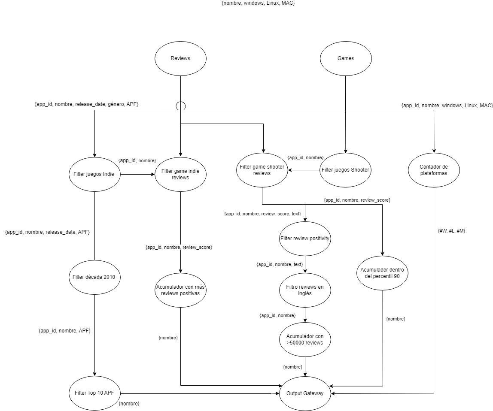
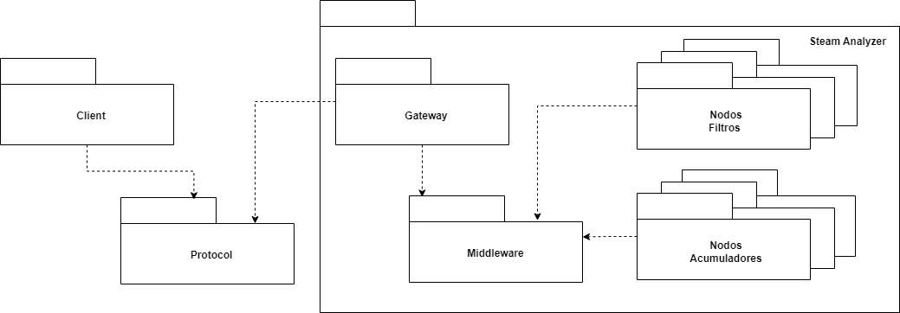
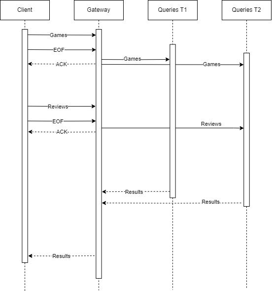
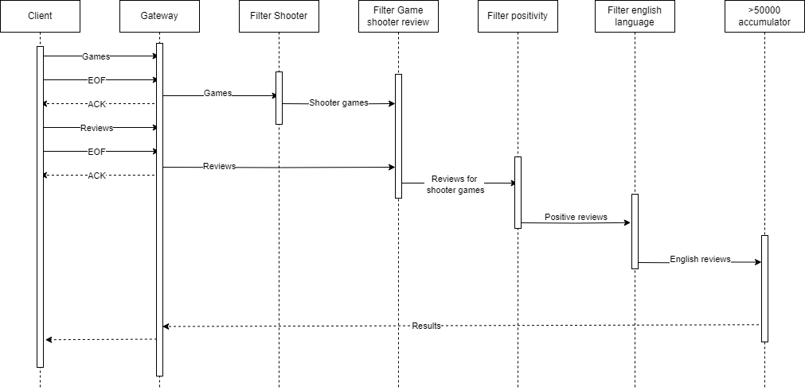
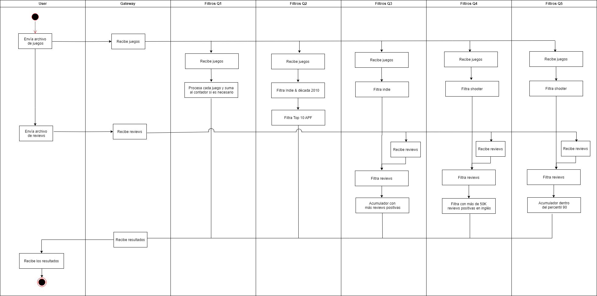
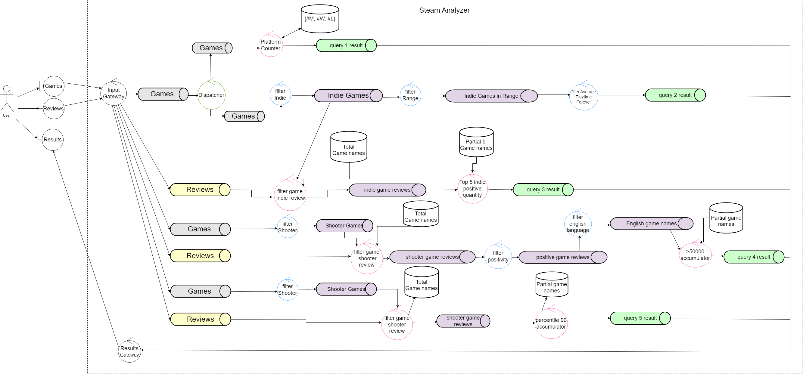
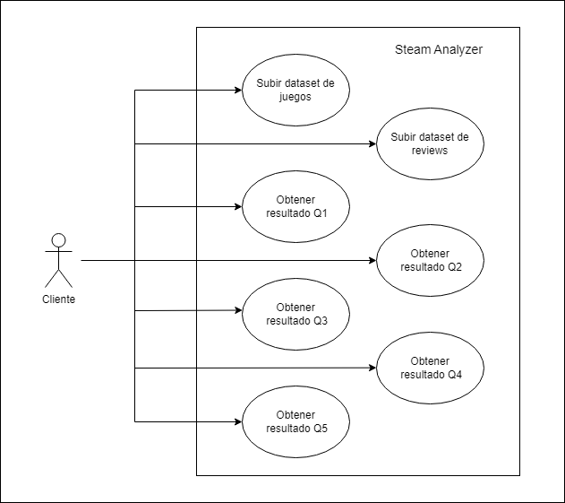

# Sistemas Distribuidos I

## Documento de Arquitectura

### Steam Analyzer

---

**Corrector**: Pablo Daniel Roca

**Alumnos**:
- **Duca Francisco**  
  *(Padrón #106308)*  
  [fduca@fi.uba.ar](mailto:fduca@fi.uba.ar)
  
- **Nahuel Nicolás Gomez**  
  *(Padrón #106514)*  
  [nngomez@fi.uba.ar](mailto:nngomez@fi.uba.ar)

---

Facultad de Ingeniería, Universidad de Buenos Aires

---

## Tabla de Contenidos
1. [Introducción](#introducción)
2. [Supuestos e Hipótesis](#supuestos-e-hipótesis)
3. [Vista Lógica](#vista-lógica)
   - [DAG](#dag)
4. [Vista de Desarrollo](#vista-de-desarrollo)
   - [Diagrama de Paquetes](#diagrama-de-paquetes)
5. [Vista de Procesos](#vista-de-procesos)
   - [Diagrama de Secuencia](#diagrama-de-secuencia)
   - [Diagrama de Secuencia Query 4](#diagrama-de-secuencia-query-4)
   - [Diagramas de Actividad](#diagramas-de-actividad)
6. [Vista Física](#vista-física)
   - [Diagrama de Robustez](#diagrama-de-robustez)
   - [Diagrama de Despliegue](#diagrama-de-despliegue)
7. [Vista de Escenarios](#vista-de-escenarios)
   - [Diagrama de casos de uso](#diagrama-de-casos-de-uso)
8. [Conclusión](#conclusión)
9. [Referencias](#referencias)

---

## Introducción

El objetivo de este sistema es procesar 5 queries sobre un dataset de juegos y otro dataset de reviews. Las queries son las siguientes:
- Cantidad de juegos soportados en cada plataforma (Windows, Linux, MAC).
- Nombre de los juegos top 10 del género "Indie" publicados en la década del 2010 con más tiempo promedio histórico de juego.
- Nombre de los juegos top 5 del género "Indie" con más reseñas positivas.
- Nombre de juegos del género "shooter" con más de 50.000 reseñas positivas en idioma inglés.
- Nombre de juegos del género "shooter" dentro del percentil 90 en cantidad de reseñas negativas.

El sistema debe soportar el incremento de los volúmenes de cómputo, con tal de poder escalar el poder de procesamiento y debe estar optimizado para entornos multicomputadora.

---

## Supuestos e Hipótesis

Al momento de la realización de este documento sobre el diseño del sistema, se tendrán en cuenta las siguientes hipótesis:
- El cliente enviará al servidor todo el dataset de juegos y luego todo el dataset de reviews.
- La capacidad del dataset de juegos sumado al dataset de reviews en cada cliente no deberá superar los 10GB de información.
- Se tendrán en cuenta fallos en la red, provocando que se empleen métodos de resiliencia sobre los nodos.
- El sistema podrá soportar en simultáneo a diferentes clientes en paralelo.

---

## Vista Lógica

### Descripción General

Describe la organización del sistema desde un punto de vista funcional, identificando los componentes principales (como los filtros, acumuladores y nodos de procesamiento) y sus interacciones para cumplir con los requerimientos de las queries.

### DAG

El diagrama presenta dos fuentes principales de datos: Reviews y Games. Estos datos se envían por diferentes pipes y filters. Los filtros especializados (Filtros juegos indie, Filtros juegos shooter, Filtro reviews en inglés, Filtro de positividad) procesan los datos de manera independiente, permitiendo escalabilidad y claridad en el flujo de datos. Los acumuladores y contadores recopilan los resultados necesarios para las consultas específicas, que luego son enviados al Output Gateway para su entrega al cliente.

---

## Vista de Desarrollo

### Descripción General

Enfocada en la estructura interna del código, esta vista detalla cómo se organizan los módulos y componentes del software. Describe las dependencias entre los paquetes y cómo cada componente se implementa y colabora para cumplir con las responsabilidades asignadas.

### Diagrama de Paquetes

El Steam Analyzer está organizado de la siguiente manera:
- **Cliente**: Representa el punto de entrada para los usuarios, donde pueden enviar datos y recibir respuestas de las queries.
- **Protocolo**: Maneja la comunicación y el formato de los datos entre el cliente y el sistema, asegurando que las interacciones se realicen correctamente.
- **Gateway**: Actúa como intermediario, recibiendo datos del cliente y dirigiéndolos a través del middleware hacia los nodos adecuados dentro del sistema.
- **Middleware**: Componente central que facilita la comunicación y la gestión de datos entre diferentes nodos del sistema, encargándose de la distribución eficiente de las tareas.
- **Nodos Filtros**: Conjunto de nodos que procesan los datos entrantes según criterios específicos para determinar qué datos deben avanzar en el sistema.
- **Nodos Acumuladores**: Estos nodos se encargan de recopilar y almacenar los datos para procesarlos posteriormente y dar una respuesta.

---

## Vista de Procesos

### Descripción General

Describe la dinámica en tiempo de ejecución del sistema. Se enfoca en cómo se manejan la sincronización y la comunicación entre los diferentes procesos que conforman el sistema, asegurando que los datos fluyan de manera eficiente y que las tareas de procesamiento se realicen de forma distribuida.

### Diagrama de Secuencia

El diagrama representa una secuencia generalizada de todas las queries. Las queries T1 representan los filtros y acumuladores que solo requieren información contenida en el dataset de games. A su vez, las queries T2 representan las que requieren, además de información del dataset de games, también datos contenidos en el dataset de reviews.

### Diagrama de Secuencia Query 4

Este diagrama está realizado a partir de la query N° 4. En el diagrama se observa primeramente la conexión entre el cliente y el gateway. Esta comunicación se realiza directamente por socket TCP. Dado esto, se realiza el envío de los juegos y reviews, y a su vez para cada envío, el Gateway devuelve los ACK correspondientes. Luego, los diferentes filtros van reduciendo la cantidad de datos que satisfacen las diferentes condiciones.

### Diagramas de Actividad

Este diagrama representa las diferentes actividades que se van realizando, abarcando simultáneamente las 5 queries. Por esta razón, hay actividades que se encuentran conjuntas, dado que se prefirió realizarlo desde un enfoque general y no hacer énfasis en actividades atómicas dentro de cada query.

---

## Vista Física

### Descripción General

Se refiere a la distribución física del sistema en diferentes nodos o máquinas, detallando la infraestructura de hardware y redes utilizadas. Aquí se explica cómo los nodos se comunican a través de colas de RabbitMQ y cómo se despliega el sistema en diferentes entornos, garantizando su escalabilidad y robustez.

### Diagrama de Robustez

Se observan los diferentes recorridos para cada ejercicio a realizar.

---

## Vista de Escenarios

### Diagrama de Casos de Uso

- **Subir dataset de juegos**: Representa la capacidad del cliente de poder enviar información al servidor sobre un archivo `.csv` de un dataset de juegos.
- **Subir dataset de reviews**: Representa la capacidad del cliente para enviar datos al servidor sobre un archivo `.csv` de un dataset de reviews, vinculado al dataset de juegos anteriormente mencionado.
- **Obtener resultado Qn**: Simboliza la entrega de queries hacia al cliente, habiendo procesado información sobre los dos datasets de juegos y reviews.

---

## Conclusión

El diseño del sistema ha sido optimizado para procesar eficientemente queries sobre datasets de juegos y reseñas en entornos distribuidos. La arquitectura, basada en filtros y acumuladores, garantiza la correcta distribución de datos entre los nodos, optimizando el procesamiento paralelo y permitiendo la escalabilidad para manejar múltiples clientes de forma simultánea. El uso de RabbitMQ facilita la comunicación robusta entre los nodos, permitiendo la resiliencia frente a fallos en la red. La implementación asegura que el sistema pueda adaptarse a futuros incrementos en la carga de trabajo y a nuevas funcionalidades, garantizando un rendimiento consistente y confiable en el análisis de datos.

---

## Referencias

- Diagramas URL: [https://app.diagrams.net/#G1ulP_ZXDmKxFdNZ-LUm7jfHcT5aoyZu8B](https://app.diagrams.net/#G1ulP_ZXDmKxFdNZ-LUm7jfHcT5aoyZu8B)
- División de Tareas URL: [https://docs.google.com/document/d/1-VCTcDncvWLDFWJXKJFVhiyWTsa5zDwi79PSLgcnLe0/edit](https://docs.google.com/document/d/1-VCTcDncvWLDFWJXKJFVhiyWTsa5zDwi79PSLgcnLe0/edit)
